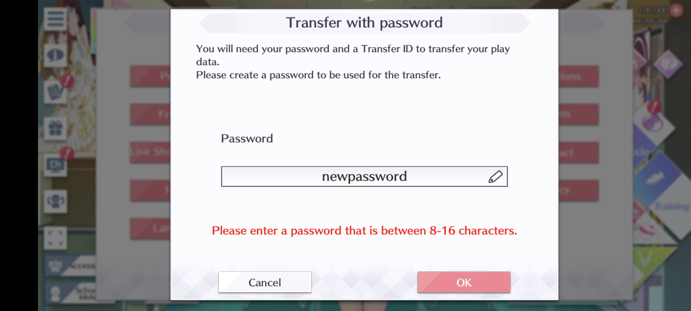
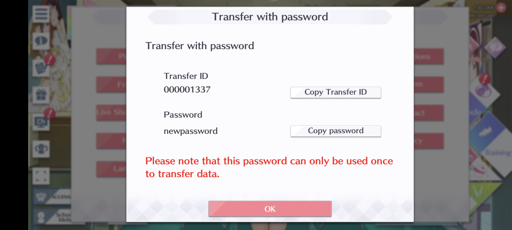

# niconi
Magisk module of elichika for simpily install in rooted Android phone.
## manual install
* install patched as.apk
* install niconi module
* reboot phone
* connect to pc, set pc ip to 192.168.31.2, or you can modify /data/adb/modules/niconi/config.json to you pc ip
* in pc run cdn server. use any tool is ok, put assets to static/
* start game it will download assets for pc, takes about 10 minutes and 17GB space.
## restore existing game
* rename /sdcard/Android/data/com.klab.lovelive.allstars.global(jp version path is similar) to something else
* copy /data/data/com.klab.lovelive.allstars.global/shared_prefs/com.klab.lovelive.allstars.v2.playerprefs.xml to /sdcard
* install patched as.apk
* install niconi reboot phone
* start game onece, it will show error. force close it
* clear app data
* start game again, close it
* edit copy /data/data/com.klab.lovelive.allstars.global/shared_prefs/com.klab.lovelive.allstars.v2.playerprefs.xml <string name="SQ">wgY7bcfzRmHWOxt0FWfwu2qxz85CPS142N7T8leTY7g%3D</string> change key between SQ"> and </string> to value of your backup up file.
* remove /sdcard/Android/data/com.klab.lovelive.allstars.global, restore your origianl folder
* start the game, it should work. if not, try manual install.

## fast install
* uninstall game if already installed
* copy as.apk and llas.apk to /sdcard
* install as.apk, start game, it will show error
* clear app data
* install niconi module, it will take about 7-9 minutes
* reboot
* start the game, it should work.
> llas.zip contains com.klab.lovelive.allstars.global folder for /sdcard/Android/data and a matching com.klab.lovelive.allstars.v2.playerprefs.xml file.

# elichika
A fork of https://github.com/arina999999997/elichika/tree/arina which is a fork of https://github.com/YumeMichi/elichika, check out the original.

## Installing
copy the zip file to phone, install with magisk app. kernelsu has not been tested.

### Window / Linux
Build executable for Android.
```
./b.sh
```
> windows user can copy commands in b.sh to build, zip command is needed.

copy niconi.zip to your phone.

## Setting up config file
Use ``config.json`` to change some runtime parameters. The server come with a ready-to-go config by default, so if you're fine with it, you can skip this part.

- ``"cdn_server"`` 
    - The server for client to download assets.
    - The script's config use https://llsifas.catfolk.party/static/ (special thanks to sarah for hosting it).
    - We can host our own CDN with `elichika` by put the relevant files in `elichika/static`.
        - You should look into this if you want to further develop the game/server, as doing so might require redownloading things a lot.
- ``"server_address"``
    - The address to host the server at.
    - Default to ``0.0.0.0:8080`` (server listen at port 8080 on all interfaces).
- ``"tap_bond_gain"``
    - The amount of bond gained by tapping an idol.
    - Default to `20` like the original, but we can change it to a big value to skip farming bond.

## Playing the game
With the server running, and the client network setup correctly, simply open the game and play.

Logging in will create an account if one is not present in the server.
- User ID will be set to random if there is no user ID in the client.

### Multi accounts / Account transfer
You can use the account transfer system to switch / create account. Select ``transfer with password``. 


Enter your user / player ID and a password:
- UserID is an non-negative integer with at most 9 digits.
- If user is in the database, password will be checked against the stored password.
- Otherwise a new account with that player ID and password.
    - You can also leave the password empty.


After that, confirm the transfer and you can login with the new user ID.


At any point, you can use the transfer ID system inside the game to change your password.





### Client version
You can use both the Japanese and Global client for the same server (and the same database).

However, it's recommended to not play one account (user ID) in both Japanese and Global client, because some contents are exclusive to only 1 server, and will cause the client to freeze.

### Multiplayer
The current implementation doesn't explicitly support multiplayer:

- More precisely, it doesn't support 2 clients connecting at once.
- If something happens to works, it just happen to works.
- If something fails, it's the expected outcome.

So you can switch accounts and things should work, but logging in with multiple clients might result in problems.

## WebUI
The WebUI for the sever can be located at `<server_address>/webui`.
- By default, this is http://127.0.0.1:8080/webui
- The WebUI can be used to do stuff that the client can't do on its own.
    - For example, the birthday can only be set during tutorial. The WebUI can change the birthday.
- For now, the WebUI can also be used to add accessories, as drop aren't implemented properly.

## More docs
Checkout the [docs](https://github.com/arina999999997/elichika/tree/master/docs) for more details on the server and how to do more advanced stuffs. 

## Credit
Special thanks to the LL Hax community for:

- Archiving and hosting database / assets
- Original elichika release
- General and specific knowledges about the game.

### patched database
for japanese version, you need to download [patched database](https://mega.nz/folder/gwJizZjS#v_fSOadf9yrb_eaOze2r7Q)
for gl version, it is already included in static folder.

### Clients
Use [3.12.0 clients](https://selenachina-my.sharepoint.com/:u:/p/walter/ER6SWMf1vKBMsm39VVXq9AABH4SCwxx7pnB4aWJanR116A?e=snCBhP). For fast install you need to download [llas.zip](https://selenachina-my.sharepoint.com/:u:/p/walter/EUkzHP6PAMNEjRzCjBZCiEYBC2tI5NxwnrrCyAEGUhFI4g?e=E0L15K).

